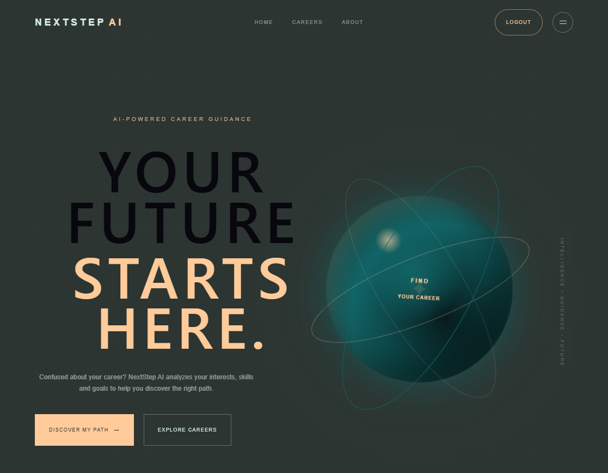
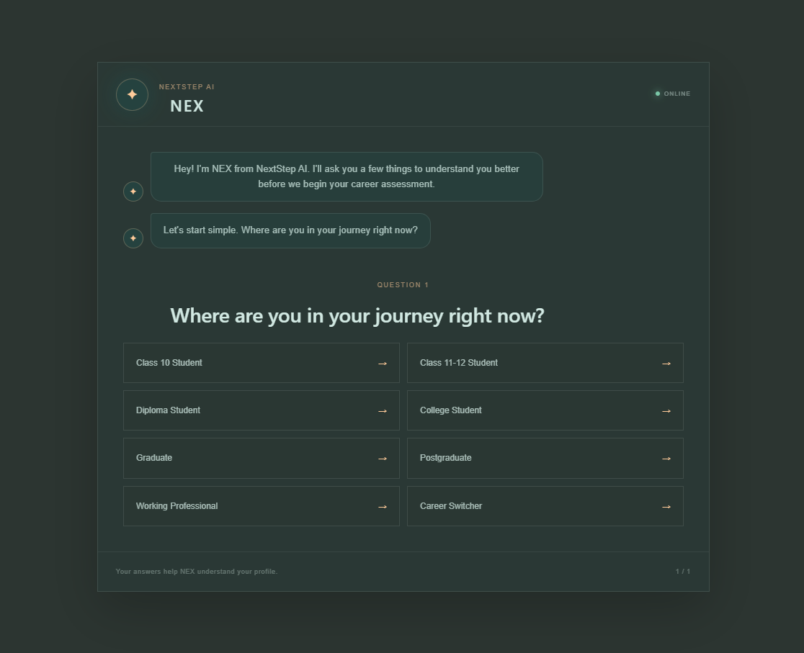
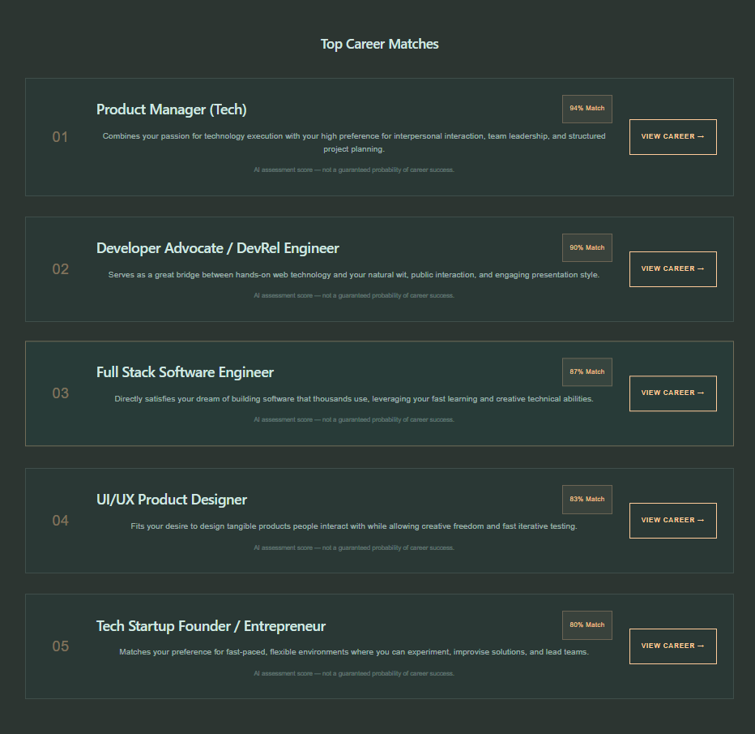
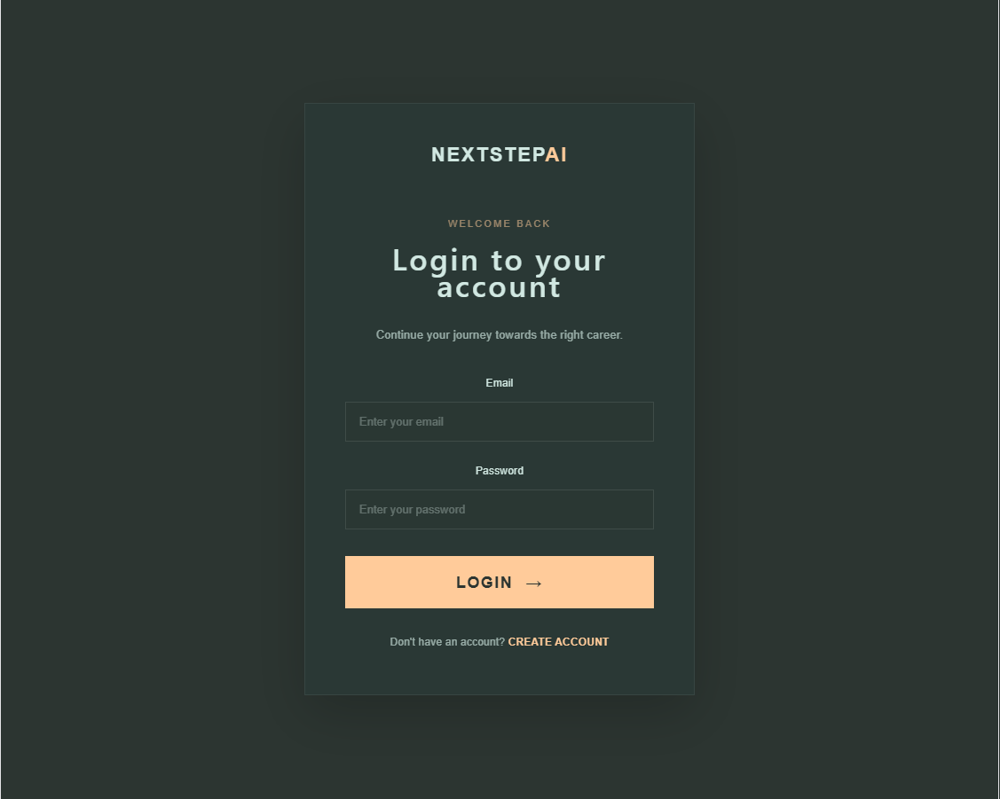
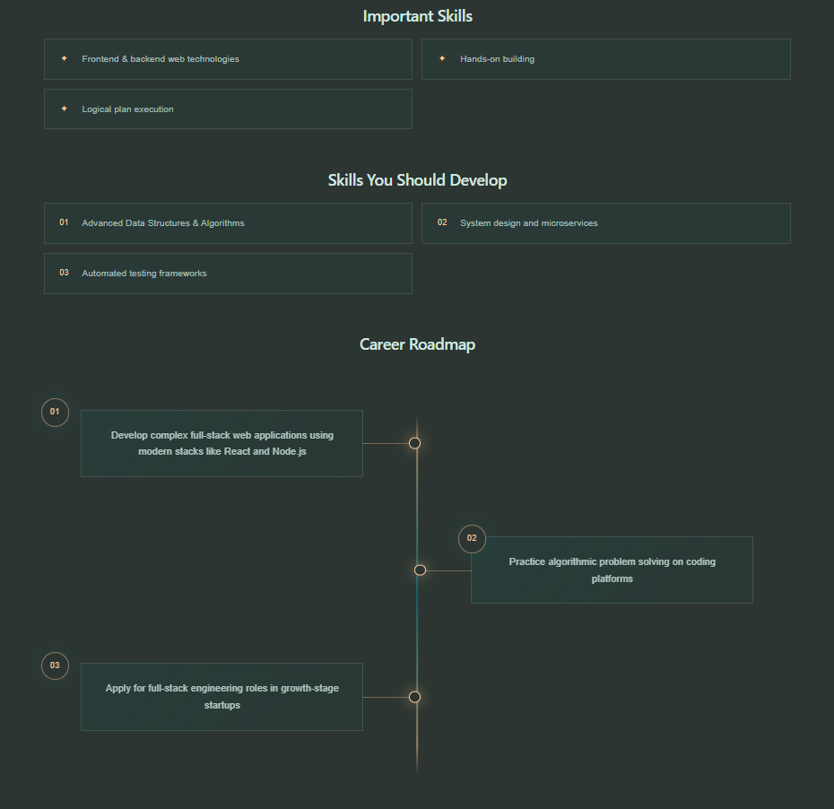

\# 🚀 NextStep AI


\*\*NextStep AI\*\* is an AI-powered career guidance platform designed to help students discover suitable career paths based on their interests, skills, and preferences.


Instead of randomly choosing a career, users can take an AI-powered career assessment and receive personalized career recommendations.


\## ✨ Features


\* 🔐 User Registration \& Login

\* 🤖 AI-powered Career Assessment

\* 🧠 Personalized Career Recommendations

\* 📋 AI-generated Assessment Questions

\* 📊 Career Profile Analysis

\* 💾 Save Career Assessment Results

\* 🔑 JWT-based Authentication

\* 👤 Protected User Routes

\* 🎯 Career Category Exploration

\* 📱 Responsive React Interface


\## 🛠️ Tech Stack


\### Frontend


\* React.js

\* Vite

\* JavaScript

\* HTML5

\* CSS3

\* Axios

\* React Router


\### Backend


\* Node.js

\* Express.js

\* REST API

\* JWT Authentication

\* bcrypt


\### Database


\* MongoDB

\* Mongoose


\### AI


\* Google Gemini API


\### Development Tools


\* VS Code

\* Git

\* GitHub

\* npm


\## 🧩 How It Works


```text

User

&#x20; ↓

Register / Login

&#x20; ↓

Career Assessment

&#x20; ↓

AI-generated Questions

&#x20; ↓

User Answers

&#x20; ↓

AI Analysis

&#x20; ↓

Personalized Career Recommendations

&#x20; ↓

Save Assessment

```


## 📸 Screenshots

### Home Page


### Career Assessment


### AI Questions


### Career Recommendations


### Login Page


### Career Roadmap



\## 📁 Project Structure


```text

NextStep-AI/

│

├── backend/

│   ├── src/

│   │   ├── controllers/

│   │   │   ├── authController.js

│   │   │   └── careerController.js

│   │   │

│   │   ├── middleware/

│   │   │   └── authMiddleware.js

│   │   │

│   │   ├── models/

│   │   │   ├── Assessment.js

│   │   │   └── User.js

│   │   │

│   │   ├── routes/

│   │   │   ├── authRoutes.js

│   │   │   └── careerRoutes.js

│   │   │

│   │   ├── app.js

│   │   └── server.js

│   │

│   └── package.json

│

├── frontend/

│   ├── src/

│   │   ├── components/

│   │   ├── pages/

│   │   ├── assets/

│   │   ├── App.jsx

│   │   ├── App.css

│   │   └── main.jsx

│   │

│   ├── public/

│   └── package.json

│

├── .gitignore

└── README.md

```


\## ⚙️ Getting Started


\### 1. Clone the repository


```bash

git clone https://github.com/krishrajputw/NextStep-AI.git

cd NextStep-AI

```


\### 2. Install frontend dependencies


```bash

cd frontend

npm install

```


\### 3. Install backend dependencies


Open another terminal:


```bash

cd backend

npm install

```


\### 4. Configure environment variables


Create a `.env` file inside the `backend` directory.


```env

PORT=5000

MONGO\_URI=your\_mongodb\_connection\_string

JWT\_SECRET=your\_jwt\_secret

GEMINI\_API\_KEY=your\_gemini\_api\_key

```


> Never commit your `.env` file or API keys to GitHub.


\### 5. Start the backend


```bash

cd backend

npm run dev

```


\### 6. Start the frontend


```bash

cd frontend

npm run dev

```


The frontend will run on the Vite development server.


\## 🔐 Authentication


NextStep AI uses \*\*JWT-based authentication\*\* to protect user-specific functionality.


Authenticated users can:


\* Access protected career features

\* Generate career assessments

\* Analyze their career profile

\* Save assessment results


\## 🤖 AI Integration


The application uses the \*\*Google Gemini API\*\* to generate career assessment questions and analyze user responses.


The AI workflow helps transform user-provided information into personalized career guidance.


\## 🎯 Project Goal


The goal of NextStep AI is to make career exploration easier for students who are unsure about what career path to choose.


The platform combines:


\*\*Assessment + AI Analysis + Career Recommendations\*\*


into one application.


\## 🔮 Future Improvements


\* Career roadmap generation

\* Skill-gap analysis

\* Personalized learning resources

\* Job and internship recommendations

\* AI career chatbot

\* User dashboard with assessment history

\* More detailed career analytics


\## 👨‍💻 Author


\*\*Krish Rajput\*\*


B.Tech ( Computer Science \& Engineering )


GitHub: \[@krishrajputw](https://github.com/krishrajputw)


\---


⭐ If you find this project useful, consider giving it a star!


